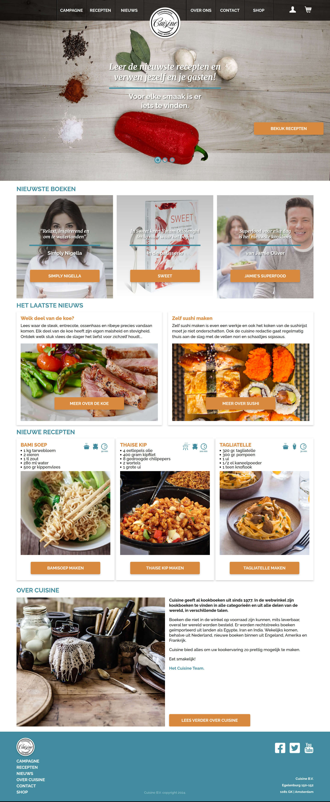

[](https://app.netlify.com/sites/cmm-front-end-developer-module-2-mm-b/deploys)
# MM-B (Eindopdracht)

Beste developers & docenten,

Dit het _README bestand_ van MM-B.

Voor de beste leesresultaten, dit Markdown (.md) bestanden lezen in een Markdown previewer.

Met vriendelijke groet,

André de Groot

---
## Opdrachtomschrijving

Produceer de website van Cuisine aan de hand van het aangeleverde conceptboek.

## Paginaoverzicht

Dit zijn de meest \*belangrijke\* pagina's **met scripts**:

- [Homepage slider](https://cmm-front-end-developer-module-2-mm-b.netlify.app)
- [Recepten filter](https://cmm-front-end-developer-module-2-mm-b.netlify.app/pages/recepten/recepten)
- [Welk deel van de koe](https://cmm-front-end-developer-module-2-mm-b.netlify.app/pages/nieuws/welk-deel-van-de-koe)
- [Boekenshop](https://cmm-front-end-developer-module-2-mm-b.netlify.app/pages/shop/shop)
- [Mijn account Tabbladen](https://cmm-front-end-developer-module-2-mm-b.netlify.app/pages/shop/mijn-account)
- [Registratie pagina](https://cmm-front-end-developer-module-2-mm-b.netlify.app/pages/shop/mijn-account)
- [Contact pagina](https://cmm-front-end-developer-module-2-mm-b.netlify.app/pages/contact)
- [Mijn account Formulier](https://cmm-front-end-developer-module-2-mm-b.netlify.app/pages/shop/mijn-account)

Dit zijn de pagina's **zonder scripts/weinig scripts**
- [Winkelwagen](https://cmm-front-end-developer-module-2-mm-b.netlify.app/pages/shop/winkelwagen)

### Overig & opmerkingen

- [HTML5 video](https://cmm-front-end-developer-module-2-mm-b.netlify.app/pages/campagne)
- "Welk deel van de koe" is **niet** met Adobe Animate gemaakt, maar met puur Javascript.
- Mm-b-styles.scss is het hoofd style bestand.
- In de partial _setup.scss staan de variabelen, mixins, etc.

### NPM

```
npm install

npm start
```

```Javascript
console.log('Hallo, wereld!');
```

### Afsluiting

De uiteindelijk Cuisine website zal worden geupload op:

[Live demo MM-B Cuisine](https://cmm-front-end-developer-module-2-mm-b.netlify.app)

### Screenshot Project MM-B

